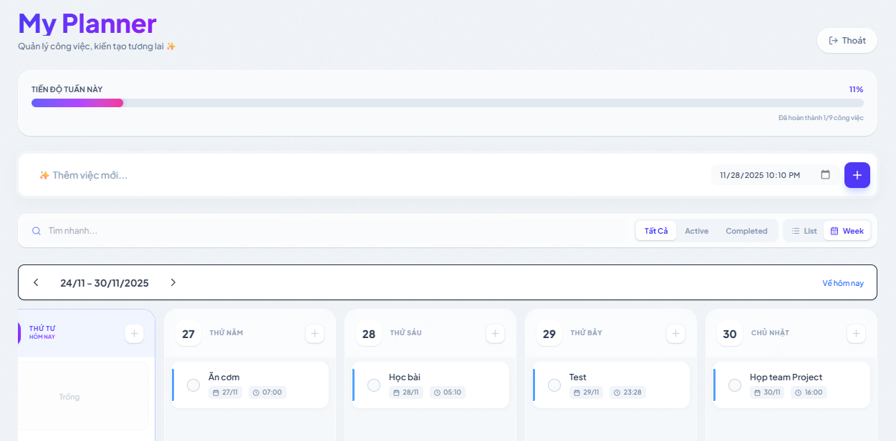
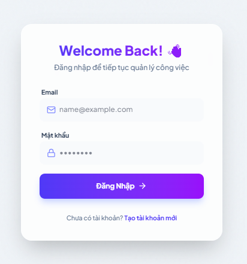

# 📅 Smart Weekly Planner

> A modern, full-stack productivity application designed to help users organize tasks effectively using both List and Weekly Kanban views. Built with the **MERN Stack** and **TypeScript**.

[](https://reactjs.org/)
[](https://www.typescriptlang.org/)
[](https://nodejs.org/)
[](https://www.mongodb.com/)
[](https://tailwindcss.com/)

## 🚀 Live Demo

Check out the live application here: **[Smart Planner Demo](https://todo-app-gules-omega-28.vercel.app)**

---

## 📸 Screenshots

### 1. Dashboard (Weekly Kanban View)


### 2. Login Page (Glassmorphism UI)


---

## ✨ Key Features

* **🔐 Authentication System:** Secure Login & Registration using JWT (JSON Web Tokens) and Bcrypt for password hashing.
* **📊 Weekly Kanban Board:** A drag-and-drop interface (powered by `dnd-kit`) to schedule tasks across 7 days.
* **⚡ Optimistic UI:** Instant visual updates for drag-and-drop and task creation, ensuring zero-latency user experience.
* **🎨 Glassmorphism UI:** Modern, responsive design with glass effects, gradients, and smooth transitions using Tailwind CSS.
* **🔄 Smart View Switching:** Automatically switches from Kanban to List view when searching to improve readability.
* **📱 Mobile-First Design:** Fully responsive layout that works seamlessly on mobile devices with horizontal scrolling support.
* **🔍 Advanced Task Management:**
    * Create, Read, Update, Delete (CRUD) tasks.
    * Filter by status (All, Active, Completed).
    * Real-time search functionality.
    * Task progress tracking via a visual progress bar.

---

## 🛠️ Tech Stack

### Frontend
* **Framework:** React 18 (Vite)
* **Language:** TypeScript
* **State Management & Caching:** TanStack Query (React Query) v5
* **Styling:** Tailwind CSS (v4)
* **Drag & Drop:** @dnd-kit (Core, Sortable, Utilities)
* **Forms & Validation:** React Hook Form + Zod
* **Icons:** Lucide React
* **Date Handling:** date-fns

### Backend
* **Runtime:** Node.js
* **Framework:** Express.js
* **Language:** TypeScript
* **Database:** MongoDB (Mongoose ODM)
* **Security:** CORS, Dotenv, Bcryptjs, Jsonwebtoken

---

## ⚙️ Installation & Setup

Follow these steps to run the project locally:

### 1. Clone the repository
```bash
git clone https://github.com/mthegn1212/todo-app.git
cd todo-app
```
### 2. Backend Setup
Navigate to the server directory and install dependencies:
```bash
cd server
npm install
```

Create a `.env` file in the `server` directory and add your variables:
```env
PORT=5000
MONGO_URI=your_mongodb_connection_string
JWT_SECRET=your_super_secret_key
```

Start the backend server:
```bash
npm run dev
```
*(Server will run at http://localhost:5000)*

### 3. Frontend Setup
Open a new terminal, navigate to the client directory and install dependencies:
```bash
cd client
npm install
```

Start the frontend development server:
```bash
npm run dev
```
*(Client will run at http://localhost:5173)*

---

## 📂 Project Structure

```
todo-app/
├── client/                 # Frontend (React + Vite)
│   ├── src/
│   │   ├── api/            # Axios configuration & API calls
│   │   ├── components/     # Reusable UI components (TaskItem, WeeklyView...)
│   │   ├── pages/          # Main pages (Dashboard, Login, Register)
│   │   └── ...
│   └── ...
├── server/                 # Backend (Node.js + Express)
│   ├── src/
│   │   ├── controllers/    # Request logic
│   │   ├── models/         # Mongoose Schemas
│   │   ├── routes/         # API Routes
│   │   ├── middleware/     # Auth middleware
│   │   └── ...
│   └── ...
└── README.md
```

---

## 🤝 Contributing

Contributions are welcome! Please fork the repository and create a pull request for any improvements.

## 👨‍💻 Author

**Trinh Minh Thang**
* **Role:** Full-stack Developer
* **Email:** minhthangcoder@gmail.com
* **GitHub:** [mthegn1212](https://github.com/mthegn1212)

---
*Happy Coding! 🚀*